# Class7: Machine Learning 1
Raneem Kassar (PID: A17803411)

- [Background](#background)
- [K-means clustering](#k-means-clustering)
- [Hierarchical Clustering](#hierarchical-clustering)
  - [Principal Component Analysis
    (PCA)](#principal-component-analysis-pca)
  - [Analysis of UK food data](#analysis-of-uk-food-data)
  - [Data Import](#data-import)
  - [Tidy the data](#tidy-the-data)
  - [Exporatory Analysis](#exporatory-analysis)
  - [PCA](#pca)
  - [PCA to the rescue](#pca-to-the-rescue)

## Background

Today we will explore some corre machine learning methods that are very
popular in bioinformatics. These include **clustering** and
**dimensionallity reduction**.

## K-means clustering

The main function in “base” R for K-means clustering is called
`kmeans()`

Before we go too deep let’s make up some “simple” data that we can
cluster and know if we are getting a good answer or not. To do this we
can use `Rnorm()` function:

``` r
hist( rnorm(10000, mean =3) )
```

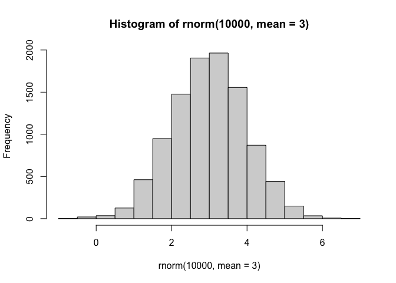

``` r
x<- c(rnorm(30, -3), rnorm(30, +3) )
z <- cbind(x=x, y=rev(x))
plot(z)
```

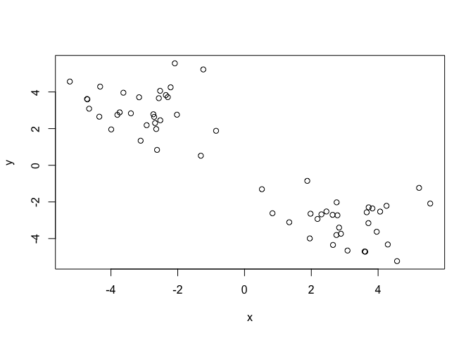

Now we can run `kmeans()` on this input `z` and see what the results
look like.

``` r
km <- kmeans(z, centers = 2)
km
```

    K-means clustering with 2 clusters of sizes 30, 30

    Cluster means:
              x         y
    1 -3.037106  3.062609
    2  3.062609 -3.037106

    Clustering vector:
     [1] 1 1 1 1 1 1 1 1 1 1 1 1 1 1 1 1 1 1 1 1 1 1 1 1 1 1 1 1 1 1 2 2 2 2 2 2 2 2
    [39] 2 2 2 2 2 2 2 2 2 2 2 2 2 2 2 2 2 2 2 2 2 2

    Within cluster sum of squares by cluster:
    [1] 75.86521 75.86521
     (between_SS / total_SS =  88.0 %)

    Available components:

    [1] "cluster"      "centers"      "totss"        "withinss"     "tot.withinss"
    [6] "betweenss"    "size"         "iter"         "ifault"      

``` r
attributes(km)
```

    $names
    [1] "cluster"      "centers"      "totss"        "withinss"     "tot.withinss"
    [6] "betweenss"    "size"         "iter"         "ifault"      

    $class
    [1] "kmeans"

> Q. How many points are in each cluster?

``` r
km$size
```

    [1] 30 30

> Q. What “component of your result object details cluser
> assignment/membership?

``` r
km$cluster
```

     [1] 1 1 1 1 1 1 1 1 1 1 1 1 1 1 1 1 1 1 1 1 1 1 1 1 1 1 1 1 1 1 2 2 2 2 2 2 2 2
    [39] 2 2 2 2 2 2 2 2 2 2 2 2 2 2 2 2 2 2 2 2 2 2

> Q. What “component of your result object details cluster center?

``` r
km$centers
```

              x         y
    1 -3.037106  3.062609
    2  3.062609 -3.037106

> Q. plot `z` colored by the kmeans cluster assignment and add cluster
> centers as blue points

``` r
plot(z, col = c("red", "blue") )
```

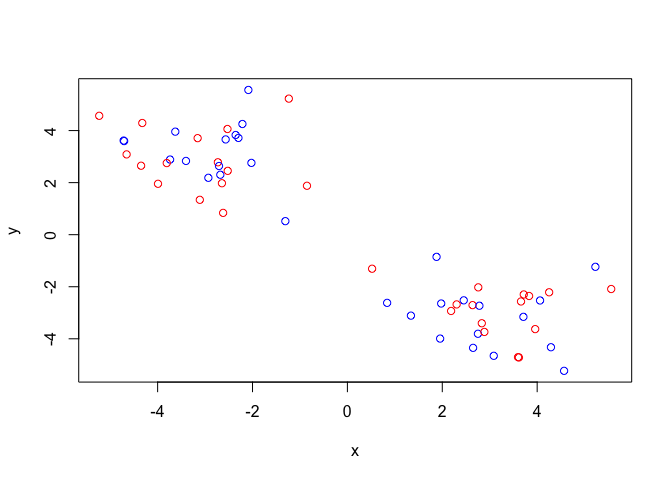

``` r
plot(z, col= km$cluster)
points(km$centers, col="blue", pch=15)
```

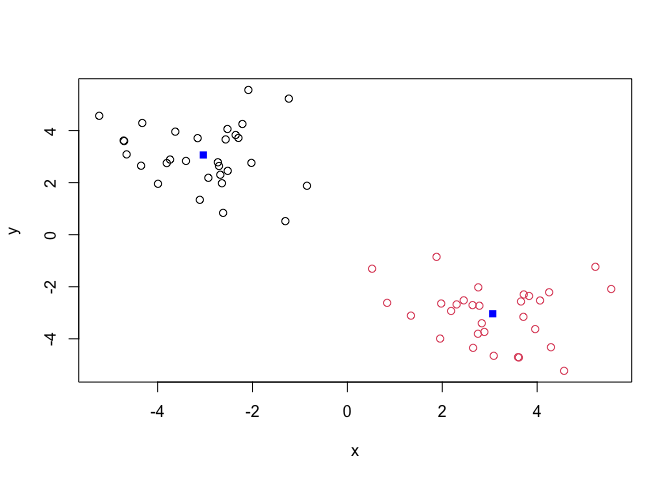

> Q. Run a K-means clustering and plot the results asking for 4 clusters
> (K=4)?

``` r
km4 <- kmeans(z, centers = 4)
plot(z, col=km4$cluster)
points(km4$centers, col="black", pch=15)
```

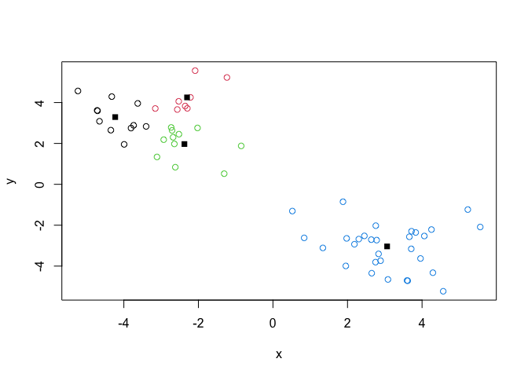

> **N.B.** You need to tell K-means the number of clusters (ie set
> `centers=2`)!!

One approach is to try different values for `centers` and then pick the
best…

``` r
ans <- NULL
for(i in 1:10) {
km <- kmeans(z, centers=i)
ans <- c(ans,km$tot.withinss)
}

plot(ans, type="o", 
     xlab="Number of Clusters",
     ylab="Total Sum of Squares Distance")
```

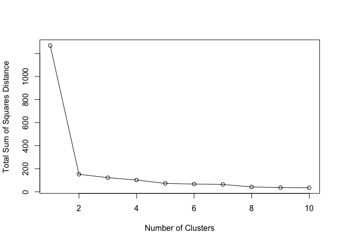

# Hierarchical Clustering

The main function in “base” R for Hierarchical Clustering is called
`hclust()`

This function does not take your “raw” data for clustering. You must
first build a “distance matrix” from your data and pass this as input to
`hclust()`

``` r
d <- dist(z)
hc <- hclust(d)
hc
```


    Call:
    hclust(d = d)

    Cluster method   : complete 
    Distance         : euclidean 
    Number of objects: 60 

There isa bespoke `plot()` methdo for `hclust()` result objects.

``` r
plot(hc)
abline(h=8, col="red")
```

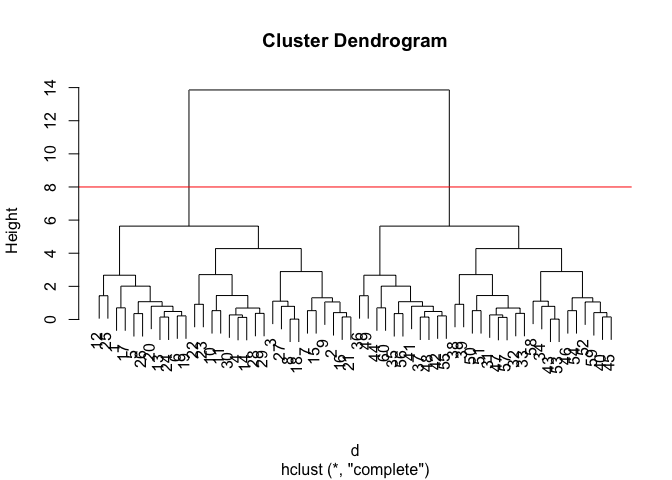

Once we have our `hclust` object (our “tree” of “cluster dendrogram) we
can *“cut”* the tree to reveal the clustering pattern.

``` r
cutree(hc, h=8)
```

     [1] 1 1 1 1 1 1 1 1 1 1 1 1 1 1 1 1 1 1 1 1 1 1 1 1 1 1 1 1 1 1 2 2 2 2 2 2 2 2
    [39] 2 2 2 2 2 2 2 2 2 2 2 2 2 2 2 2 2 2 2 2 2 2

``` r
cutree(hc, k=4)
```

     [1] 1 2 2 2 1 1 2 2 2 2 2 1 1 2 2 2 1 2 1 1 2 2 2 1 1 1 2 2 2 2 3 3 3 3 4 4 4 3
    [39] 3 3 4 4 3 4 3 3 3 4 4 3 3 3 3 3 4 4 3 3 3 4

> Q. Make a plot of `z` with your hclust results (i.e. colored by
> cluster membership)

``` r
grps <- cutree(hc, k=2)
plot(z, col=grps)
```

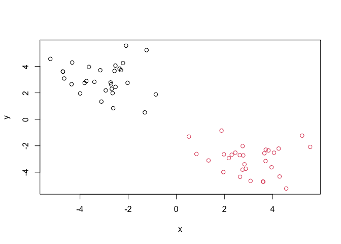

## Principal Component Analysis (PCA)

PCA is a dimensionallity reduction method that is popular for revealing
patterns in complex datasets

## Analysis of UK food data

Let’s look at some data on the eating habits of folks from the UK to see
if there are patterns and trends that have some regionss being distinct
from others.

## Data Import

The data is made avaliable in CSV format so we can use `read.csv()`
function for import R

``` r
url <- "https://tinyurl.com/UK-foods"
x <- read.csv(url)
x
```

                         X England Wales Scotland N.Ireland
    1               Cheese     105   103      103        66
    2        Carcass_meat      245   227      242       267
    3          Other_meat      685   803      750       586
    4                 Fish     147   160      122        93
    5       Fats_and_oils      193   235      184       209
    6               Sugars     156   175      147       139
    7      Fresh_potatoes      720   874      566      1033
    8           Fresh_Veg      253   265      171       143
    9           Other_Veg      488   570      418       355
    10 Processed_potatoes      198   203      220       187
    11      Processed_Veg      360   365      337       334
    12        Fresh_fruit     1102  1137      957       674
    13            Cereals     1472  1582     1462      1494
    14           Beverages      57    73       53        47
    15        Soft_drinks     1374  1256     1572      1506
    16   Alcoholic_drinks      375   475      458       135
    17      Confectionery       54    64       62        41

``` r
rownames(x) <- x[,1]
x <- x[,-1]
```

> Q1. How many rows and columns are in your new data frame named x? What
> R functions could you use to answer this questions?

``` r
dim(x)
```

    [1] 17  4

There are 17 rows and 4 columns.

## Tidy the data

Fix anything that went wrong with data import.

> Q2. Which approach to solving the ‘row-names problem’ mentioned above
> do you prefer and why? Is one approach more robust than another under
> certain circumstances?

``` r
head(x)
```

                   England Wales Scotland N.Ireland
    Cheese             105   103      103        66
    Carcass_meat       245   227      242       267
    Other_meat         685   803      750       586
    Fish               147   160      122        93
    Fats_and_oils      193   235      184       209
    Sugars             156   175      147       139

``` r
dim(x)
```

    [1] 17  4

I prefer using read.csv(url, row.names =1) as it solves the row names
problem during the data import and the approach is less likely to cause
issues due to the first column being treated as row names. However,
manually setting the rownames(x) \<- x\[,1\] and then removing the x can
be more robust than the other if you want to inspect the dat first and
confirm the column names.

## Exporatory Analysis

Make some plots to help make sense of obvious trends…

## PCA

``` r
barplot(as.matrix(x), beside=T, col=rainbow(nrow(x)))
```

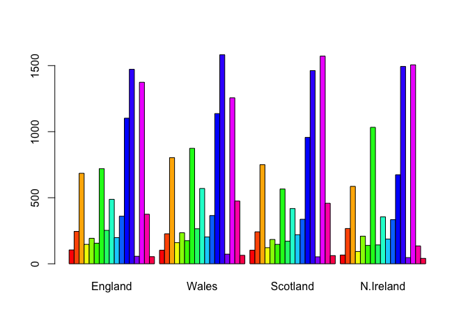

``` r
barplot(as.matrix(x), beside= FALSE, col=rainbow(nrow(x)))
```


> Q3. Changing what optional argument in the above barplot() function
> results in the following plot?

Changing beside= T to beside= FALSE.

``` r
library(tidyr)

x_long <- x |> 
  tibble::rownames_to_column("Food") |> 
  pivot_longer(cols = -Food, 
               names_to = "Country", 
               values_to = "Consumption")

dim(x_long)
```

    [1] 68  3

``` r
head(x_long)
```

    # A tibble: 6 × 3
      Food            Country   Consumption
      <chr>           <chr>           <int>
    1 "Cheese"        England           105
    2 "Cheese"        Wales             103
    3 "Cheese"        Scotland          103
    4 "Cheese"        N.Ireland          66
    5 "Carcass_meat " England           245
    6 "Carcass_meat " Wales             227

``` r
library(ggplot2)
```

``` r
ggplot(x_long) +
  aes(x = Country, y = Consumption, fill = Food) +
  geom_col(position = "stack") +
  theme_bw()
```

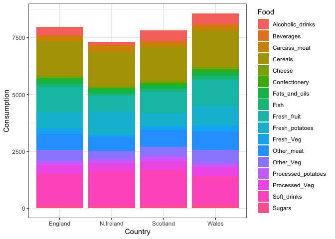

> . Q4: Changing what optional argument in the above ggplot() code
> results in a stacked barplot figure.

Changing the optional argument position int the geom_col() function from
“dodge” to “stack” results in a stacked barplot.

> . **Q5:** We can use the pairs() function to generate all pairwise
> plots for our countries. Can you make sense of the following code and
> resulting figure? What does it mean if a given point lies on the
> diagonal for a given plot?

``` r
pairs(x, col = rainbow(nrow(x)), pch = 16)
```


The pairs() function makes scatter plots comparing every pair of
countries, each point represents a food type. If a point lies on the
diagonal line for a given plot this means that the food has similar
consumption value in both countries being compared. Points far from the
diagonal show foods consumed differently between countries.

``` r
library(pheatmap)
pheatmap(as.matrix(x))
```

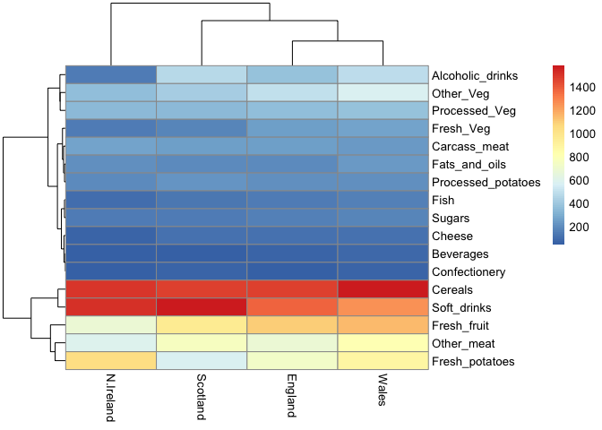

> Q6. Based on the pairs and heatmap figures, which countries cluster
> together and what does this suggest about their food consumption
> patterns? Can you easily tell what the main differences between N.
> Ireland and the other countries of the UK in terms of this data-set?

Based on the pairs plot and heat map, Wales, England, and Scotland
cluster more closely together while Ireland is more separate This
suggests that they have more similar food consumption patterns while
Ireland is different. It is a bit easier to view Ireland differing from
other countries but still difficult to identify main differences.

> **Key Point**: Even relatively small dataets can prove challenging to
> interpret.

## PCA to the rescue

The main function in “base” R for PCA is called `prcomp()`. This
function wants the “observations to be rows and the”variables” to be
columns.

So here we need to take the transpose of our `x` input object

``` r
pca <- prcomp(t(x))
summary(pca)
```

    Importance of components:
                                PC1      PC2      PC3       PC4
    Standard deviation     324.1502 212.7478 73.87622 2.921e-14
    Proportion of Variance   0.6744   0.2905  0.03503 0.000e+00
    Cumulative Proportion    0.6744   0.9650  1.00000 1.000e+00

``` r
# Create a data frame for plotting
df <- as.data.frame(pca$x)
df$Country <- rownames(df)

# Plot PC1 vs PC2 with ggplot
ggplot(pca$x) +
  aes(x = PC1, y = PC2, label = rownames(pca$x)) +
  geom_point(size = 3) +
  geom_text(vjust = -0.5) +
  xlim(-270, 500) +
  xlab("PC1") +
  ylab("PC2") +
  theme_bw()
```


> Q7. Complete the code below to generate a plot of PC1 vs PC2. The
> second line adds text labels over the data points.

The blanks are PC1 and PC2, which creates a plot comparing the two
components.

The returned ‘pca’ object has components that we can use to make oru
main result figures:

``` r
attributes(pca)
```

    $names
    [1] "sdev"     "rotation" "center"   "scale"    "x"       

    $class
    [1] "prcomp"

The main result figure from this analysis is called a **“PC score plot”
or “ordenation plot”** “PC plot” or “PC1 vs PC2 plot”.

This plot shows gow samples (jn this case countries) relate to each
other alogn our new PC axis.

This is our new “reduced-dimensional space”. In this case 2 dimesnions,
PC1 and PC2, that capture most of the variance in the original 17
dimensional data-set.

``` r
library(ggplot2)

ggplot(pca$x) + 
  aes(PC1, PC2) + 
  geom_point()
```

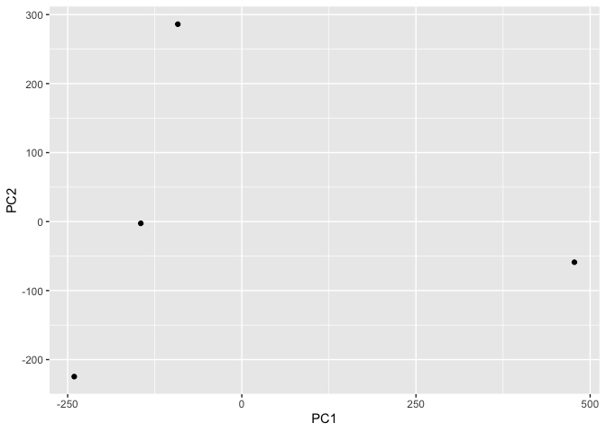

``` r
mycols <- c("orange", "red", "blue", "darkgreen")

ggplot(pca$x) + 
  aes(PC1, PC2) + 
  geom_point(col=mycols)
```

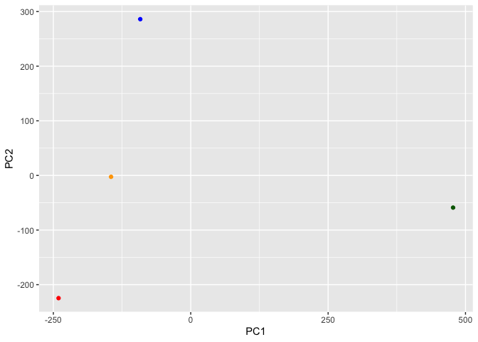

> Q8. Customize your plot so that the colors of the country names match
> the colors in our UK and Ireland map and table at start of this
> document.

Customization are shown below.

``` r
pca$x
```

                     PC1         PC2        PC3           PC4
    England   -144.99315   -2.532999 105.768945 -9.152022e-15
    Wales     -240.52915 -224.646925 -56.475555  5.560040e-13
    Scotland   -91.86934  286.081786 -44.415495 -6.638419e-13
    N.Ireland  477.39164  -58.901862  -4.877895  1.329771e-13

``` r
ggplot(pca$x) + 
  aes(PC1, PC2, label=row.names(pca$x)) + 
  geom_point(col=mycols) +
  geom_text(size=3, vjust=2, col=mycols)
```

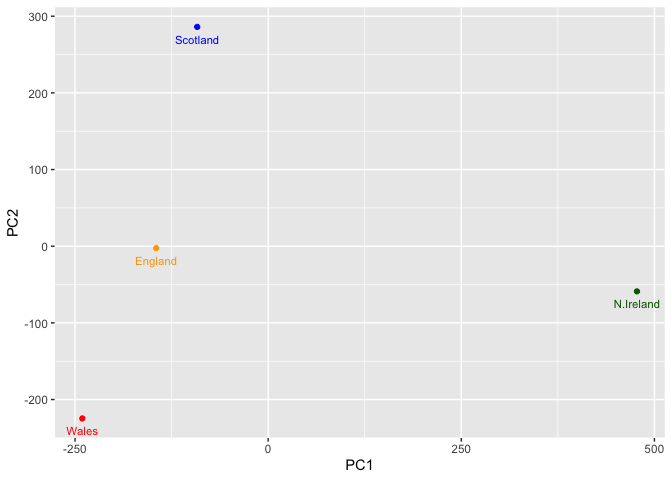

``` r
ggplot(pca$rotation) +
  aes(PC1, reorder(row.names(pca$rotation), PC1) ) +
  geom_col()
```

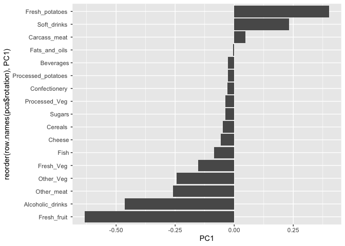

> Q9: Generate a similar ‘loadings plot’ for PC2. What two food groups
> feature prominantely and what does PC2 mainly tell us about?

``` r
ggplot(pca$rotation) +
  aes(PC2, reorder(row.names(pca$rotation), PC2) ) +
  geom_col()
```

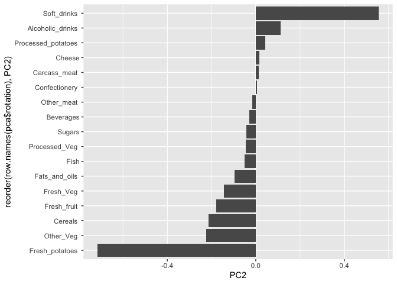

The two food spots that feature prominently in PC2 are soft_drinks on
the positive side and fresh_potatoes which is on the negative side. This
tells us that the contrast between countries associated more with soft
drink consumption versus fresh potato consumption.
