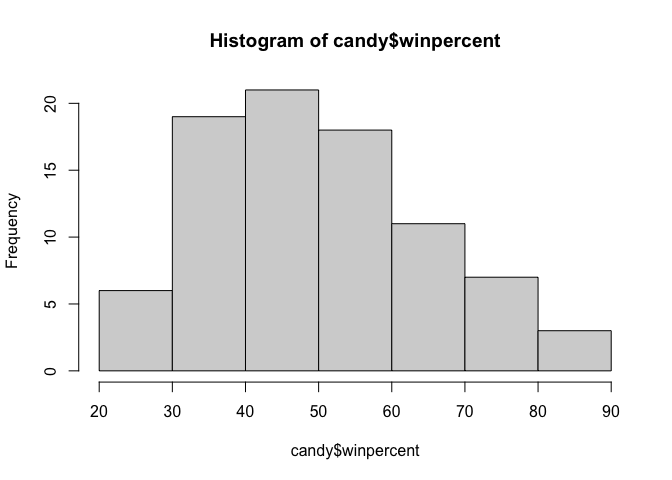
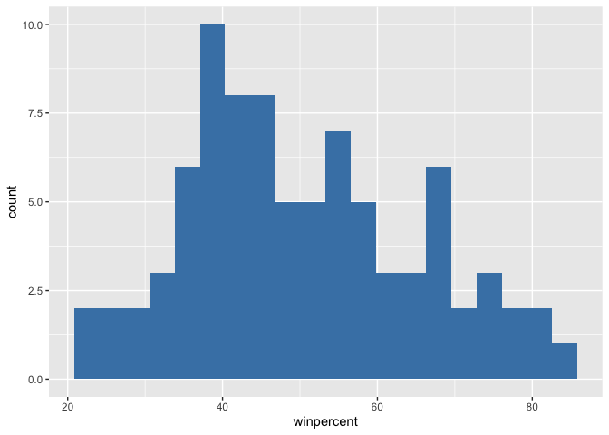
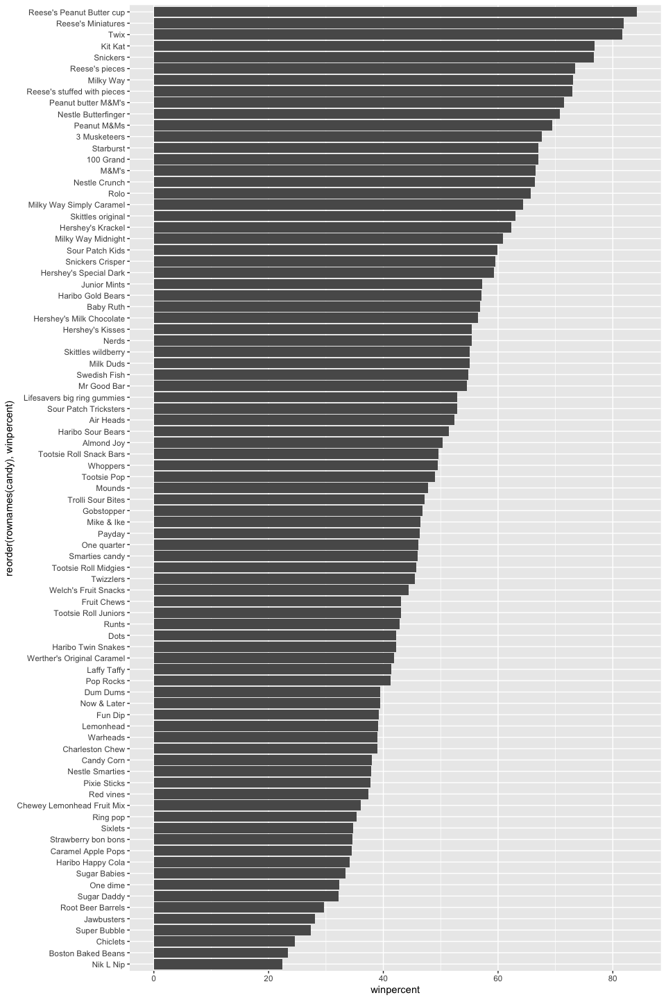
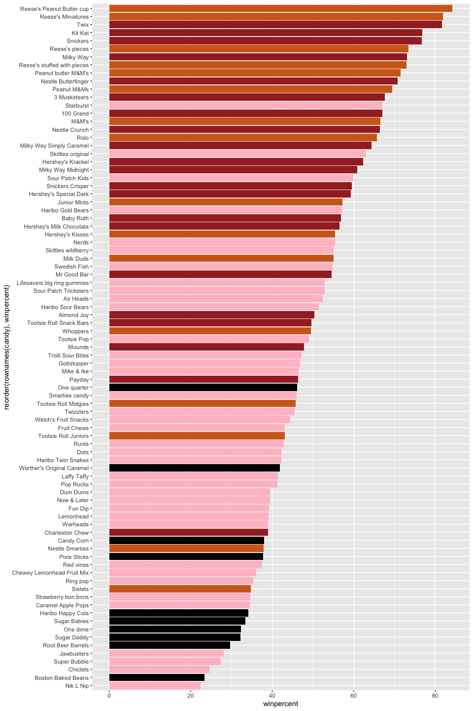
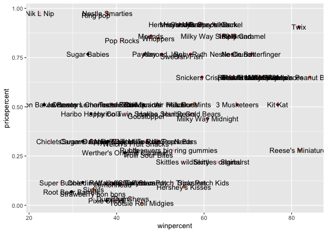
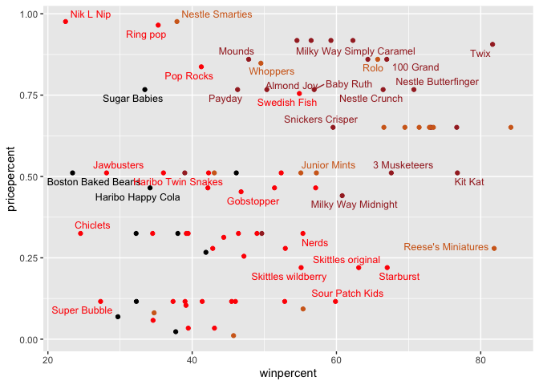
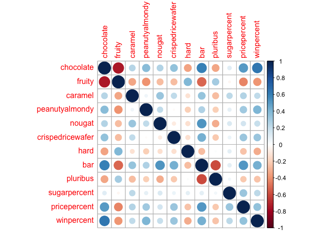
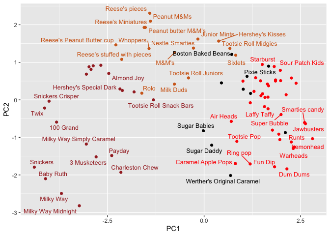

# Class09: Candy Mini Project
Raneem Kassar (PID:A17803411)

- [Background](#background)
- [2 Importing candy data](#2-importing-candy-data)
- [2.1 What is in the dataset?](#21-what-is-in-the-dataset)
- [2.2 What is your favorite candy?](#22-what-is-your-favorite-candy)
- [3 Exploratory analysis](#3-exploratory-analysis)
- [4 Overall Candy Rankings](#4-overall-candy-rankings)
- [4.0.1 Time to add some useful
  color](#401-time-to-add-some-useful-color)
- [5 Taking a look at pricepercent](#5-taking-a-look-at-pricepercent)
- [6 Exploring the correlation
  structure](#6-exploring-the-correlation-structure)
- [7 Principal Component Analysis](#7-principal-component-analysis)
- [8 Summary](#8-summary)

## Background

Today we are taking sa wee detour to analyze a fun data-set with the
most useful analysis method we have learned thus far.

## 2 Importing candy data

``` r
candy <- read.csv("https://raw.githubusercontent.com/fivethirtyeight/data/master/candy-power-ranking/candy-data.csv", row.names = 1)
head(candy)
```

                 chocolate fruity caramel peanutyalmondy nougat crispedricewafer
    100 Grand            1      0       1              0      0                1
    3 Musketeers         1      0       0              0      1                0
    One dime             0      0       0              0      0                0
    One quarter          0      0       0              0      0                0
    Air Heads            0      1       0              0      0                0
    Almond Joy           1      0       0              1      0                0
                 hard bar pluribus sugarpercent pricepercent winpercent
    100 Grand       0   1        0        0.732        0.860   66.97173
    3 Musketeers    0   1        0        0.604        0.511   67.60294
    One dime        0   0        0        0.011        0.116   32.26109
    One quarter     0   0        0        0.011        0.511   46.11650
    Air Heads       0   0        0        0.906        0.511   52.34146
    Almond Joy      0   1        0        0.465        0.767   50.34755

## 2.1 What is in the dataset?

> Q1. How many differeent candy types are in this dataset?

``` r
nrow(candy)
```

    [1] 85

There are 85 different candy types.

> Q2. How many fruity candy types are in this dataset?

``` r
sum(candy$fruity)
```

    [1] 38

There are 38 fruity candy types are in this dataset.

## 2.2 What is your favorite candy?

> Q3. What is your favorite candy (other than Twix) in the dataset and
> what is it’s winpercent value?

``` r
candy["Reese's Peanut Butter cup",]$winpercent
```

    [1] 84.18029

My favorite candy in the dataset is Reese’s Peanut Butter Cup and it’s
win percent value is 84.18029.

> Q4. What is the winpercent value for “Kit Kat”?

``` r
candy["Kit Kat",]$winpercent
```

    [1] 76.7686

The winpercent value for “Kit Kat” is 76.7686.

> Q5. What is the winpercent value for “Tootsie Roll Snack Bars”?

``` r
candy["Tootsie Roll Snack Bars",]$winpercent
```

    [1] 49.6535

The winpercent value for “Tootsie Roll Snack Bars is 49.6535.

``` r
skimr::skim(candy)
```

|                                                  |       |
|:-------------------------------------------------|:------|
| Name                                             | candy |
| Number of rows                                   | 85    |
| Number of columns                                | 12    |
| \_\_\_\_\_\_\_\_\_\_\_\_\_\_\_\_\_\_\_\_\_\_\_   |       |
| Column type frequency:                           |       |
| numeric                                          | 12    |
| \_\_\_\_\_\_\_\_\_\_\_\_\_\_\_\_\_\_\_\_\_\_\_\_ |       |
| Group variables                                  | None  |

Data summary

**Variable type: numeric**

| skim_variable | n_missing | complete_rate | mean | sd | p0 | p25 | p50 | p75 | p100 | hist |
|:---|---:|---:|---:|---:|---:|---:|---:|---:|---:|:---|
| chocolate | 0 | 1 | 0.44 | 0.50 | 0.00 | 0.00 | 0.00 | 1.00 | 1.00 | ▇▁▁▁▆ |
| fruity | 0 | 1 | 0.45 | 0.50 | 0.00 | 0.00 | 0.00 | 1.00 | 1.00 | ▇▁▁▁▆ |
| caramel | 0 | 1 | 0.16 | 0.37 | 0.00 | 0.00 | 0.00 | 0.00 | 1.00 | ▇▁▁▁▂ |
| peanutyalmondy | 0 | 1 | 0.16 | 0.37 | 0.00 | 0.00 | 0.00 | 0.00 | 1.00 | ▇▁▁▁▂ |
| nougat | 0 | 1 | 0.08 | 0.28 | 0.00 | 0.00 | 0.00 | 0.00 | 1.00 | ▇▁▁▁▁ |
| crispedricewafer | 0 | 1 | 0.08 | 0.28 | 0.00 | 0.00 | 0.00 | 0.00 | 1.00 | ▇▁▁▁▁ |
| hard | 0 | 1 | 0.18 | 0.38 | 0.00 | 0.00 | 0.00 | 0.00 | 1.00 | ▇▁▁▁▂ |
| bar | 0 | 1 | 0.25 | 0.43 | 0.00 | 0.00 | 0.00 | 0.00 | 1.00 | ▇▁▁▁▂ |
| pluribus | 0 | 1 | 0.52 | 0.50 | 0.00 | 0.00 | 1.00 | 1.00 | 1.00 | ▇▁▁▁▇ |
| sugarpercent | 0 | 1 | 0.48 | 0.28 | 0.01 | 0.22 | 0.47 | 0.73 | 0.99 | ▇▇▇▇▆ |
| pricepercent | 0 | 1 | 0.47 | 0.29 | 0.01 | 0.26 | 0.47 | 0.65 | 0.98 | ▇▇▇▇▆ |
| winpercent | 0 | 1 | 50.32 | 14.71 | 22.45 | 39.14 | 47.83 | 59.86 | 84.18 | ▃▇▆▅▂ |

> Q6. Is there any variable/column that looks to be on a different scale
> to the majority of the other columns in the dataset?

Yes, the variable that looks most different in scale is winpercent. Most
of the other columns are on a scale that range as 0 to 1. For example,
chocolate and caramel only use 0 and 1 values, also, sugarpercent and
pricepercent are percentile values as 0 pr 1. However, winpercent is
measured as a percentage from 0 to 100%.

> Q7. What do you think a zero and one represent for the
> candy\$chocolate column?

For the candy\$chocolate column, a zero would represent the candy
contains no chocolate, while 1 represents the candy contains chocolate.

## 3 Exploratory analysis

> Q8. Plot a histogram of winpercent values using both base R and
> ggplot2.

``` r
hist(candy$winpercent)
```



I plotted a histogram of winpercent values using both base R and
ggplot2.

``` r
library(ggplot2)

ggplot(candy) +
  aes(winpercent) +
  geom_histogram(bins=20, fill="steelblue")
```



> Q9. Is the distribution of winpercent values symmetrical?

The distribution of winpercent values seems to be not perfecltly
symmetrical and more leaning right skewed.

> Q10. Is the center of the distribution above or below 50%?

``` r
mean(candy$winpercent)
```

    [1] 50.31676

``` r
summary(candy$winpercent)
```

       Min. 1st Qu.  Median    Mean 3rd Qu.    Max. 
      22.45   39.14   47.83   50.32   59.86   84.18 

The center of distribution is around 50%. The mean is slightly above 50%
at 50.31676, but the median is slightly below at 47.83. Overall, the
distribution is centered close to 50%.

> Q11. On average is chocolate candy higher or lower ranked than fruit
> candy?

``` r
choc.ind <- as.logical(candy$chocolate)
choc.candy <- candy[choc.ind, ]
choc.win <- choc.candy$winpercent
mean(choc.win)
```

    [1] 60.92153

``` r
fruit.ind <- as.logical(candy$fruity)
fruit.candy <- candy[fruit.ind,]
fruit.win <- fruit.candy$winpercent
mean(fruit.win)
```

    [1] 44.11974

On average, chocolate is higher ranked than fruity candy as chocolate’s
mean is 60.92153, and fruit candy is 44.11974.

> Q12. Is this difference statistically significant?

``` r
t.test(choc.win, fruit.win)
```


        Welch Two Sample t-test

    data:  choc.win and fruit.win
    t = 6.2582, df = 68.882, p-value = 2.871e-08
    alternative hypothesis: true difference in means is not equal to 0
    95 percent confidence interval:
     11.44563 22.15795
    sample estimates:
    mean of x mean of y 
     60.92153  44.11974 

This difference is statistically significant because the welch two
sample t-test gives a p-value of 2.871e-08, which is much smaller than
0.05. There is strong evidence that chocolate candies and fruity candies
have different average winpercent values.

## 4 Overall Candy Rankings

> Q13. What are the five least liked candy types in this set?

``` r
library(dplyr)
```


    Attaching package: 'dplyr'

    The following objects are masked from 'package:stats':

        filter, lag

    The following objects are masked from 'package:base':

        intersect, setdiff, setequal, union

``` r
candy |>
  arrange(winpercent) |>
  select(winpercent) |>
    head(5)
```

                       winpercent
    Nik L Nip            22.44534
    Boston Baked Beans   23.41782
    Chiclets             24.52499
    Super Bubble         27.30386
    Jawbusters           28.12744

The five least liked candy types in this set are Nik L Nip, Boston Baked
Beans, Chiclets, Super Bubble, and Jawbusters.

``` r
x <- c(5,10,1)
sort(x)
```

    [1]  1  5 10

``` r
head(candy [ order(candy$winpercent), ], 5)
```

                       chocolate fruity caramel peanutyalmondy nougat
    Nik L Nip                  0      1       0              0      0
    Boston Baked Beans         0      0       0              1      0
    Chiclets                   0      1       0              0      0
    Super Bubble               0      1       0              0      0
    Jawbusters                 0      1       0              0      0
                       crispedricewafer hard bar pluribus sugarpercent pricepercent
    Nik L Nip                         0    0   0        1        0.197        0.976
    Boston Baked Beans                0    0   0        1        0.313        0.511
    Chiclets                          0    0   0        1        0.046        0.325
    Super Bubble                      0    0   0        0        0.162        0.116
    Jawbusters                        0    1   0        1        0.093        0.511
                       winpercent
    Nik L Nip            22.44534
    Boston Baked Beans   23.41782
    Chiclets             24.52499
    Super Bubble         27.30386
    Jawbusters           28.12744

> Q14. What are the top 5 all time favorite candy types out of this set?

``` r
library(dplyr)

candy |>
  arrange(desc(winpercent)) |>
  select(winpercent) |>
  head(5)
```

                              winpercent
    Reese's Peanut Butter cup   84.18029
    Reese's Miniatures          81.86626
    Twix                        81.64291
    Kit Kat                     76.76860
    Snickers                    76.67378

The five all time favorite candy types in this data set are Reese’s
Peanut Butter cup, Reese’s Miniatures, Twix, Kit Kat, and Snickers.

> Q15. Make a first barplot of candy ranking based on winpercent values.

``` r
ggplot(candy) +
  aes(winpercent, rownames(candy)) +
  geom_col()
```


This barplot shows the overall candy rankings based on winpercent
values. Each candy is on the y axis while the win percentage is on the x
axis.

> Q16. This is quite ugly, use the reorder() function to get the bars
> sorted by winpercent?

``` r
ggplot(candy) +
  aes(winpercent, reorder(rownames(candy), winpercent)) +
  geom_col()
```



I used the reorder() function to sort the candy names by their
winpercent values.

## 4.0.1 Time to add some useful color

``` r
mycols <- rep("black", nrow(candy))

## Chocolate candy in chocolate color
mycols [ as.logical(candy$chocolate) ] <- "chocolate"
# candy bars in brown
mycols [as.logical(candy$bar) ] <- "brown"
# fruity candy in pink
mycols [as.logical(candy$fruity) ] <- "pink"


ggplot(candy) + 
 aes(winpercent, 
     reorder(rownames(candy), winpercent)) +
  geom_col(fill = mycols) 
```



> Q17. What is the worst ranked chocolate candy?

The worst ranked chocolate candy is Sixlets.

> Q18. What is the best ranked fruity candy?

The best ranked fruit candy according to the plot is Starburst.

## 5 Taking a look at pricepercent

``` r
ggplot(candy) +
  aes(winpercent, 
      pricepercent,
        label=rownames(candy)) +
  geom_point(col=mycols) +
  geom_text()
```



We can fixthe label overplotting with an add-on package called
**ggrepel** and it’s `geom_text_repel()`

``` r
# fruity candy in pink
mycols [as.logical(candy$fruity) ] <- "red" #"pink"
```

``` r
library(ggrepel)

ggplot(candy) +
  aes(winpercent, 
      pricepercent,
        label=rownames(candy)) +
  geom_point(col=mycols) +
  geom_text_repel(col = mycols, size = 3.3, max.overlaps = 5)
```



> Q19. Which candy type is the highest ranked in terms of winpercent for
> the least money - i.e. offers the most bang for your buck?

The candy that is highest ranked in terms of winpercent is Reese’s
minatures with a winpercent of 81.86626 with a low pricepercent value.

> Q20. What are the top 5 most expensive candy types in the dataset and
> of these which is the least popular?

The top 5 most expensive candy types in the dataset are Nik L Nip,
Nestle Samrtes, Ring Pop, Hershey;s Krackel, and Hershey’s Milk
Chocolate. The least popular amogn these is Nik L Nip with a winpercent
value at 22.44534.

## 6 Exploring the correlation structure

We can calculate the pair-wise correlation of all our columns

``` r
cij <- cor(candy)

library(corrplot)
```

    corrplot 0.95 loaded

``` r
corrplot(cij)
```



> Q22. Examining this plot what two variables are anti-correlated
> (i.e. have minus values)?

The two variables that most anti-correlated in this data set are
chocolate and fruity.

> Q23. Use your corrplot result to make a prediction: which variables do
> you expect will have the largest contributions (i.e. loadings) to PC1
> (i.e., drive the most separation between candies along the first
> principal component)?

The variables I expect will have the largest contributions to PC1 are
chocolate and fruity. This due to to the variables strongly seperate
candy types due to chocolate and fruit candies being negatively
correlated. Also, variables like bar and winpercent will contribute to
PC1 due to chocolate tends tend to be more popular and expensive.

## 7 Principal Component Analysis

In this case we want to be set `scale=TRUE` argument for
`prcomp()`because we have on variable, `win percent` that is on a very
different scale than all others and would otherwise dominate our PCA
results.

``` r
pca <- prcomp(candy, scale=TRUE)
summary(pca)
```

    Importance of components:
                              PC1    PC2    PC3     PC4    PC5     PC6     PC7
    Standard deviation     2.0788 1.1378 1.1092 1.07533 0.9518 0.81923 0.81530
    Proportion of Variance 0.3601 0.1079 0.1025 0.09636 0.0755 0.05593 0.05539
    Cumulative Proportion  0.3601 0.4680 0.5705 0.66688 0.7424 0.79830 0.85369
                               PC8     PC9    PC10    PC11    PC12
    Standard deviation     0.74530 0.67824 0.62349 0.43974 0.39760
    Proportion of Variance 0.04629 0.03833 0.03239 0.01611 0.01317
    Cumulative Proportion  0.89998 0.93832 0.97071 0.98683 1.00000

First major result figure is the “score plot” of PC1 vs PC2 - how the
different candy are related to each other on our new PC axis:

``` r
ggplot(pca$x) +
  aes(PC1, PC2, label=row.names(pca$x)) +
  geom_point(col=mycols) +
  geom_text_repel(size=3.3, col=mycols, max.overlaps = 7)
```



The second major results figure from PCA is the so-called “loadings
plot”

``` r
ggplot(pca$rotation)+
  aes(PC1, 
      reorder( row.names(pca$rotation), PC1))+
  geom_col()
```


> Q24. Complete the code to generate the loadings plot above. What
> original variables are picked up strongly by PC1 in the positive
> direction? Do these make sense to you? Where did you see this
> relationship highlighted previously?

The original variables picked up strongly by PC1 in the positive
direction are chocolate, bar, winpercent, and pricepercent. These make
sense to me due to chocolate and candy bars tend to be more popular and
expensive in the dataset. I saw this relationship highlighted previously
in the corrplot.

## 8 Summary

> Q25. Based on your exploratory analysis, correlation findings, and PCA
> results, what combination of characteristics appears to make a
> “winning” candy? How do these different analyses (visualization,
> correlation, PCA) support or complement each other in reaching this
> conclusion?

Based on my exploratory analysis, correlation results, and PCA, a
“winning” candy appears to be one that is chocolate-based, often a bar
and may include peanuts, caramel, or wafer. These candies tend to have
higher winpercent values. Also, the ranked bar plots showed the top
candies such as Reese’s, Kit Kat, Twix, and Snickers, which are all
chocolate candy. Different analyses support or complement each other in
reaching this conclusion through variables such as chocolate,
pricepercent, and winpercent being positively related. Finally, PCA
supported the same pattern by showing that PC1 separated chocolate bar
from fruity candies.
