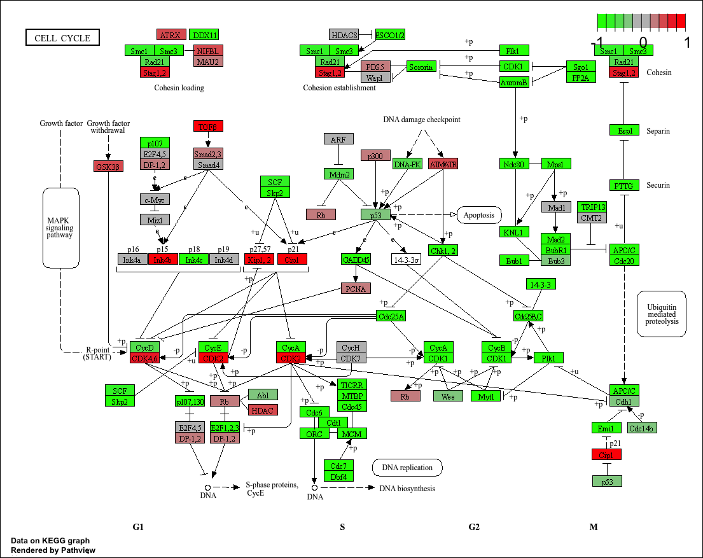

## Background

In today's mini project we will analte sara from GEO entry: GSE37704

>. Trapnell C, Hendrickson DG, Sauvageau M, Goff L et al. "Differential analysis of gene regulation at transcript resolution with RNA-seq". Nat Biotechnol 2013 Jan;31(1):46-53. PMID: 23222703

The authors report on differential analysis of lung fibroblasts in response to loss of the developmental transcription factor HOXA1.  

## Data Import
Read counts and metadata CSV files

```{r import}
library(DESeq2)
```

```{r}
metaFile <- "GSE37704_metadata.csv"
countFile <- "GSE37704_featurecounts.csv"
```

```{r}
# Import metadata
colData <- read.csv(metaFile, row.names = 1)
head(colData)

# Import count data
countData <- read.csv(countFile, row.names = 1)
head(countData)
```

### Sannity check

> Q. Complete the code below to remove the troublesome first column from countData

```{r}
# Remove the odd first length column
countData <- as.matrix(countData[, -1])
head(countData)
```

> Q. Complete the code below to filter countData to exclude genes (i.e. rows) where we have 0 read count across all samples (i.e. columns).

```{r}
# Filter count data where genes have 0 read count across all samples
countData <- countData[rowSums(countData) > 0, ]
head(countData)
```

## Setup DESeq object

```{r}
dds <- DESeqDataSetFromMatrix(countData = countData,
                              colData = colData,
                              design = ~ condition)
```

## Run DESeq analysis pipeline

```{r}
dds <- DESeq(dds)
dds
```


## Extract the results
Big table with log2 fold changes and p-values

```{r}
res <- results(dds)
res
```


> Q. Call the summary() function on your results to get a sense of how many genes are up or down-regulated at the default 0.1 p-value cutoff.

```{r}
summary(res)
```


## Data Viz
Volcano Plot

```{r}
library(ggplot2)

ggplot(as.data.frame(res)) +
  aes(x = log2FoldChange,
      y = -log10(padj)) +
  geom_point()
```

> Q. Improve this plot by completing the below code, which adds color, axis labels and cutoff lines:

```{r}
# Make a color vector for all genes
mycols <- rep("gray", nrow(res))

# Color blue the genes with fold change above 2
mycols[abs(res$log2FoldChange) > 2] <- "blue"

# Color gray those with adjusted p-value more than 0.01
mycols[res$padj > 0.05] <- "gray"

ggplot(as.data.frame(res)) +
  aes(x = log2FoldChange,
      y = -log10(padj)) +
  geom_point(color = mycols) +
  xlab("Log2(FoldChange)") +
  ylab("-Log(P-value)") +
  geom_vline(xintercept = c(-2, 2)) +
  geom_hline(yintercept = -log10(0.05))
```

## Add Annotation data
Add gene symbol entrez ids

> > Q. Use the mapIDs() function multiple times to add SYMBOL, ENTREZID and GENENAME annotation to our results by completing the code below.

```{r}
library(AnnotationDbi)
library(org.Hs.eg.db)

columns(org.Hs.eg.db)

##mapIDs()
res$symbol <- mapIds(org.Hs.eg.db,
                     keys = row.names(res),
                     keytype = "ENSEMBL",
                     column = "SYMBOL",
                     multiVals = "first")

res$entrez <- mapIds(org.Hs.eg.db,
                     keys = row.names(res),
                     keytype = "ENSEMBL",
                     column = "ENTREZID",
                     multiVals = "first")

res$name <- mapIds(org.Hs.eg.db,
                   keys = row.names(res),
                   keytype = "ENSEMBL",
                   column = "GENENAME",
                   multiVals = "first")

head(res, 10)
```

> Q. Finally for this section let's reorder these results by adjusted p-value and save them to a CSV file in your current project directory.

```{r}
res <- res[order(res$pvalue), ]
write.csv(res, file = "deseq_results.csv")
```

## Pathway analysis
KEGG, GO and REACTOME

```{r}
library(pathview)
library(gage)
library(gageData)

data(kegg.sets.hs)
data(sigmet.idx.hs)

# Focus on signaling and metabolic pathways only
kegg.sets.hs = kegg.sets.hs[sigmet.idx.hs]

# Examine the first 3 pathways
head(kegg.sets.hs, 3)
```

```{r}
foldchanges = res$log2FoldChange
names(foldchanges) = res$entrez
head(foldchanges)
```

```{r}
# Get the results
keggres = gage(foldchanges, gsets=kegg.sets.hs)
```

```{r}
attributes(keggres)
```

```{r}
# Look at the first few down (less) pathways
head(keggres$less)
```

```{r}
pathview(gene.data=foldchanges, pathway.id="hsa04110")
```



```{r}
## Focus on top 5 upregulated pathways here for demo purposes only
keggrespathways <- rownames(keggres$greater)[1:5]

# Extract the 8 character long IDs part of each string
keggresids = substr(keggrespathways, start=1, stop=8)
keggresids
```

```{r}
pathview(gene.data=foldchanges, pathway.id=keggresids, species="hsa")
```

> Q. Can you do the same procedure as above to plot the pathview figures for the top 5 down-regulated pathways?

```{r}
# Focus on top 5 downregulated pathways
keggrespathways_down <- rownames(keggres$less)[1:5]

# Extract the 8-character KEGG pathway IDs
keggresids_down <- substr(keggrespathways_down, start = 1, stop = 8)

keggresids_down

# Plot the top 5 downregulated pathways
pathview(gene.data = foldchanges,
         pathway.id = keggresids_down,
         species = "hsa")
```


### Gene Ontology (GO)

```{r}
data(go.sets.hs)
data(go.subs.hs)

# Focus on Biological Process subset of GO
gobpsets = go.sets.hs[go.subs.hs$BP]

gobpres = gage(foldchanges, gsets=gobpsets)
head(gobpres$less)
```

### REACTOME

There is an R package for this analysis and a new-ish website that

```{r}
sig_genes <- res[res$padj <= 0.05 & !is.na(res$padj), "symbol"]

print(paste("Total number of significant genes:", length(sig_genes)))

write.table(sig_genes,
            file = "significant_genes.txt",
            row.names = FALSE,
            col.names = FALSE,
            quote = FALSE)
```

> Q: What pathway has the most significant “Entities p-value”? Do the most significant pathways listed match your previous KEGG results? What factors could cause differences between the two methods?

The most significant REACTOME pathway was related to cell cycle regulation, with an "Entities p-value" of 2.63E-5. This matches my KEGG results because Cell cycle was as well the top down-regulated KEGG pathway. Overall, both analyses suggest that HOXA1 knockdown affects genes involved in cell-cycle progression. Any differences between REACTOME and KEGG may come from differences in pathway databases, gene annotations and pathway definitions, and finally statistical methods.

## Save our results

```{r}
write.csv(res, file="myresults_annotated.csv")
```

